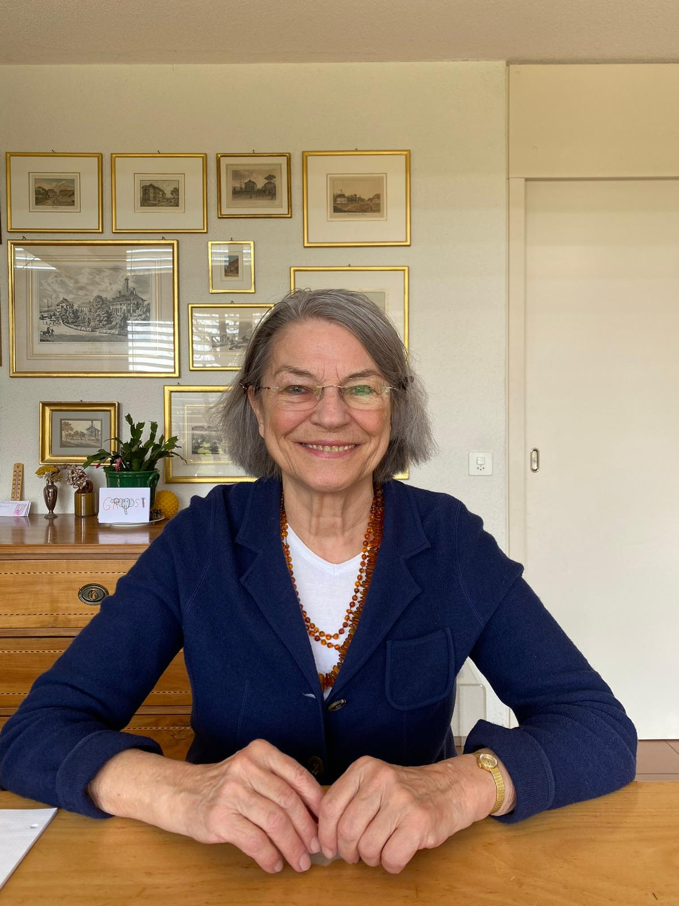

+++
title = "Den Kampf gegen den Brustkrebs "
date = "2023-04-07"
draft = false
pinned = false
image = "whatsapp-image-2023-03-19-at-14.27.30.jpeg"
+++


Brustkrebs ist eine der häufigsten Krebsarten bei Frauen weltweit. Eine von acht Frauen ist in ihrem Leben von dieser Erkrankung betroffen. Und Margrit Schmid gehörte dazu. Die Diagnose ist für die Betroffenen ein großer Schock und stellt eine enorme psychische Belastung dar. Doch wie gehen die Betroffenen mit der Situation um und welche Behandlungen stehen ihnen zur Verfügung?





Margrit Schmid (78), sie lebt momentan in Münchenbuchsee. Sie ist verheiratet, hat eigene Kinder und auch schon Grosskinder. Früher arbeitete Sie im Frauenverein und im Kirchgemeinderat. 



Ein helles, altmodisch eingerichtetes Wohnzimmer wirkt friedlich und ruhig. Man hört nur das Geschirr klirren, welches ihr Ehemann gerade wegräumt. Es duftet dezent nach Rosen und Karamell. In diesem Raum bemerkt Margrit Schmid das erste Mal einen Knoten in ihrer Brust, der ihr ganzes Leben von heute auf morgen auf den Kopf stellen würde.

Wir sitzen in Margrit Schmids Wohnzimmer. Sie trägt ein weißes T-Shirt mit einem dunkelblauen Pullover. Im Jahr 2007 erfuhr von ihrer Diagnose . Die Diagnose war Brustkrebs – ein Schock für sie und ihre Familie. Doch trotzdem geht sie sehr gelassen mit der Nachricht um, was ungewöhnlich ist. "Normalerweise" sollte man doch nach so einer Diagnose aufgelöst sein, eine enorme Angst haben und sich fragen, warum gerade ich? Doch all das hatte Margrit Schmid nicht. Sie fragte sich nicht, warum gerade ich. Angst hatte sie schon ein wenig, aber sie sagt ohne eine Sekunde zu zögern, mit gelassener Stimme: 

> *"Ich will kämpfen und alles machen, was ich kann, damit ich nachher nicht sagen muss: 'Ja, hätte ich nur'."*

***Die meisten Menschen haben das Gefühl, dass nur Frauen an Brustkrebs erkranken, aber auch Männer sind betroffen. Jährlich erkranken über 70 Männer in der Schweiz an Brustkrebs. Bei den Frauen ist es eine deutlich höhere Zahl: Jährlich erkranken in der Schweiz fast 7000 Frauen an Brustkrebs, was verglichen mit den Männern eine enorm hohe Zahl ist.*** 

Die Heilungschancen sind bei Früherkennung sehr gut. Es gibt verschiedene Behandlungsmöglichkeiten, wie Margrit erzählt. Die Behandlung, die sie durchmachen musste, war intensiv. Sie unterzog sich einer brusterhaltenden Operation, drei Monate lang wöchentlich Chemotherapie, Bestrahlung und Medikamenten. Doch sie gab nicht auf und kämpfte sich durch.

***Brustkrebs ist zwar eine der häufigsten Krebsarten bei Frauen, aber er hat heute auch eine gute Heilungsquote. Fünf Jahre nach der Diagnose leben noch 80 Prozent der erkrankten Frauen. Eine mindestens zehnjährige Nachbeobachtung empfehlen Fachleute.*** 

Trotz der Schwere der Diagnose änderte sich ihre Lebenseinstellung nicht.

>  *Ich war schon immer sehr positiv eingestellt und dachte mir, man muss das genießen, was man kann, und das andere kann man ja nicht ändern",* 

sagt sie ohne lange zu überlegen. Während der Behandlung ging es ihr erstaunlich gut, und niemand bemerkte etwas.

Ihre Diagnose hat sie nicht vielen Menschen mitgeteilt. Nur ihre Familie, einige Frauen im Frauenverein und der Präsident im Kirchgemeinderat wussten davon. Nicht einmal in ihrem Umfeld bemerkte jemand eine Veränderungen. 

> *"Es ging weiter wie sonst auch"*.

 Natürlich hatte Margrit Angst, dass es nicht gut ausgehen würde. "Man denkt schon jeden Tag daran, aber jetzt nicht panisch. Es ist halt ein ständiger Begleiter von einem, dass es sein kann", im Hintergrund hört man plötzlich ganz leise ihren Mann seufzen als er ihre Aussage gehört hat. Und leider gab es auch Spätfolgen. Nach sieben Jahren hatte sie Rückenschmerzen, die sich als Brustkrebsableger im Wirbel herausstellten. Sie musste weitere Behandlungen über sich ergehen lassen und sich insgesamt 32 Mal jeden Tag im Lindenhof-Spital bestrahlen lassen. Doch auch das hat sie gemeistert.